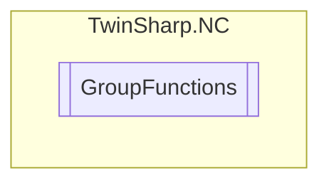

# GroupFunctions `Public class`

## Description
The GroupFunctions class provides methods to control and manage an axis group in a TwinCAT NC (Numerical Control) system.
            It allows for resetting, stopping, clearing, and performing an emergency stop on the group.
            Additionally, it supports starting and managing FIFO (First In, First Out) operations for the group.

## Diagram


## Members
### Methods
#### Public  methods
| Returns | Name |
| --- | --- |
| `void` | [`Clear`](#clear)()<br>Clear group (buffer/task) |
| `void` | [`EmergencyStop`](#emergencystop)(`double` deceleration, `double` jerk)<br>Emergency stop(E-stop) (emergency stop with controlled ramp) |
| `void` | [`FifoOverwrite`](#fifooverwrite)(`double``[]` entries)<br>Overwrite the last x FIFO entries (lines): (x*m)-values (one or more lines) n: FIFO length (number of lines) m: FIFO dimension (number of columns) range of values x: [1 ... n] |
| `void` | [`FifoStart`](#fifostart)()<br>Start FIFO group(FIFO table must have been filled in advance) |
| `void` | [`FifoWrite`](#fifowrite)(`double``[]` entries)<br>Write x FIFO entries (lines): (x*m)-values (one or more lines) n: FIFO length (number of lines) m: FIFO dimension (number of columns) range of values x: [1 ... n] |
| `void` | [`Reset`](#reset)()<br>Reset group |
| `void` | [`Stop`](#stop)()<br>Stop group |

## Details
### Summary
The GroupFunctions class provides methods to control and manage an axis group in a TwinCAT NC (Numerical Control) system.
            It allows for resetting, stopping, clearing, and performing an emergency stop on the group.
            Additionally, it supports starting and managing FIFO (First In, First Out) operations for the group.

### Constructors
#### GroupFunctions
[*Source code*](https://github.com///blob//TwinSharp/NC/GroupFunctions.cs#L15)
```csharp
internal GroupFunctions(AdsClient client, uint id)
```
##### Arguments
| Type | Name | Description |
| --- | --- | --- |
| `AdsClient` | client |   |
| `uint` | id |   |

### Methods
#### Reset
[*Source code*](https://github.com///blob//TwinSharp/NC/GroupFunctions.cs#L25)
```csharp
public void Reset()
```
##### Summary
Reset group

#### Stop
[*Source code*](https://github.com///blob//TwinSharp/NC/GroupFunctions.cs#L33)
```csharp
public void Stop()
```
##### Summary
Stop group

#### Clear
[*Source code*](https://github.com///blob//TwinSharp/NC/GroupFunctions.cs#L41)
```csharp
public void Clear()
```
##### Summary
Clear group (buffer/task)

#### EmergencyStop
[*Source code*](https://github.com///blob//TwinSharp/NC/GroupFunctions.cs#L51)
```csharp
public void EmergencyStop(double deceleration, double jerk)
```
##### Arguments
| Type | Name | Description |
| --- | --- | --- |
| `double` | deceleration | Deceleration (must be greater than or equal to the original deceleration) |
| `double` | jerk | Jerk (must greater than or equal to the original jerk) |

##### Summary
Emergency stop(E-stop) (emergency stop with controlled ramp)

#### FifoStart
[*Source code*](https://github.com///blob//TwinSharp/NC/GroupFunctions.cs#L64)
```csharp
public void FifoStart()
```
##### Summary
Start FIFO group(FIFO table must have been filled in advance)

#### FifoWrite
[*Source code*](https://github.com///blob//TwinSharp/NC/GroupFunctions.cs#L73)
```csharp
public void FifoWrite(double[] entries)
```
##### Arguments
| Type | Name | Description |
| --- | --- | --- |
| `double``[]` | entries |  |

##### Summary
Write x FIFO entries (lines): (x*m)-values (one or more lines) n: FIFO length (number of lines) m: FIFO dimension (number of columns) range of values x: [1 ... n]

#### FifoOverwrite
[*Source code*](https://github.com///blob//TwinSharp/NC/GroupFunctions.cs#L82)
```csharp
public void FifoOverwrite(double[] entries)
```
##### Arguments
| Type | Name | Description |
| --- | --- | --- |
| `double``[]` | entries |  |

##### Summary
Overwrite the last x FIFO entries (lines): (x*m)-values (one or more lines) n: FIFO length (number of lines) m: FIFO dimension (number of columns) range of values x: [1 ... n]

*Generated with* [*ModularDoc*](https://github.com/hailstorm75/ModularDoc)
