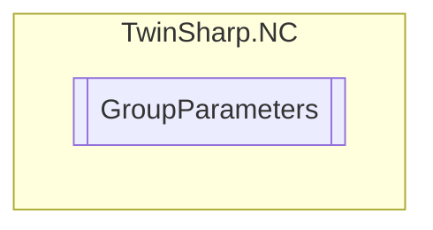

# GroupParameters `Public class`

## Diagram


## Members
### Properties
#### Public  properties
| Type | Name | Methods |
| --- | --- | --- |
| `uint` | [`FifoDimension`](#fifodimension)<br>FIFO dimension (m = number of axes) | `get` |
| [`FifoInterpolationType`](./FifoInterpolationType.md) | [`FifoInterpolationType`](#fifointerpolationtype)<br>Interpolation type for FIFO setpoint generator | `get` |
| `uint` | [`FifoLength`](#fifolength)<br>FIFO size(length) (n = number of FIFO entries) | `get` |
| [`FifoOverrideType`](./FifoOverrideType.md) | [`FifoOverrideType`](#fifooverridetype)<br>Override type for FIFO setpoint generator | `get, set` |
| `double` | [`FifoTimeDelta`](#fifotimedelta)<br>Time delta for two sequenced FIFO entries (FIFO entry timebase) | `get, set` |
| `double` | [`FifoTimeForOverrideChange`](#fifotimeforoverridechange)<br>P-T2 time for override change(T1= T2 = T0) | `get, set` |
| `uint` | [`ID`](#id)<br>Group ID | `get` |
| `uint` | [`MaxSafEntries`](#maxsafentries)<br>Size of the SAF table (max. number of SAF entries | `get` |
| `uint` | [`MaxSvbEntries`](#maxsvbentries)<br>Size of the SVB table (max. number of SVB entries | `get` |
| `string` | [`Name`](#name)<br>Group name | `get` |
| `uint` | [`NumberInTheChannel`](#numberinthechannel)<br>Number in the channel | `get` |
| `uint` | [`ParentChannelID`](#parentchannelid)<br>Channel ID that this group belongs to. | `get` |
| `string` | [`ParentChannelName`](#parentchannelname)<br>Channel name that this group belongs to. | `get` |
| [`ChannelType`](./ChannelType.md) | [`ParentChannelType`](#parentchanneltype)<br>Channel type that this group belongs to. | `get` |
| `uint` | [`SafCycleTime`](#safcycletime)<br>SAF cycle time group | `get` |
| `uint` | [`SafCycleTimeDivisor`](#safcycletimedivisor)<br>Internal SAF cycle time divisor (divides the internal SAF cycle time by this factor) | `get` |
| `bool` | [`SingleBlockOperationMode`](#singleblockoperationmode)<br>Single block operation mode. | `get, set` |
| `uint` | [`SvbCycleTime`](#svbcycletime)<br>SVB cycle time group | `get` |
| [`GroupType`](./GroupType.md) | [`Type`](#type)<br>Group type | `get` |

## Details
### Constructors
#### GroupParameters
[*Source code*](https://github.com///blob//TwinSharp/NC/GroupParameters.cs#L10)
```csharp
public GroupParameters(AdsClient client, uint id)
```
##### Arguments
| Type | Name | Description |
| --- | --- | --- |
| `AdsClient` | client |   |
| `uint` | id |   |

### Properties
#### ID
```csharp
public uint ID { get; }
```
##### Summary
Group ID

#### Name
```csharp
public string Name { get; }
```
##### Summary
Group name

#### Type
```csharp
public GroupType Type { get; }
```
##### Summary
Group type

#### SafCycleTime
```csharp
public uint SafCycleTime { get; }
```
##### Summary
SAF cycle time group

#### SvbCycleTime
```csharp
public uint SvbCycleTime { get; }
```
##### Summary
SVB cycle time group

#### SingleBlockOperationMode
```csharp
public bool SingleBlockOperationMode { get; set; }
```
##### Summary
Single block operation mode.

#### MaxSvbEntries
```csharp
public uint MaxSvbEntries { get; }
```
##### Summary
Size of the SVB table (max. number of SVB entries

#### MaxSafEntries
```csharp
public uint MaxSafEntries { get; }
```
##### Summary
Size of the SAF table (max. number of SAF entries

#### SafCycleTimeDivisor
```csharp
public uint SafCycleTimeDivisor { get; }
```
##### Summary
Internal SAF cycle time divisor (divides the internal SAF cycle time by this factor)

#### ParentChannelID
```csharp
public uint ParentChannelID { get; }
```
##### Summary
Channel ID that this group belongs to.

#### ParentChannelName
```csharp
public string ParentChannelName { get; }
```
##### Summary
Channel name that this group belongs to.

#### ParentChannelType
```csharp
public ChannelType ParentChannelType { get; }
```
##### Summary
Channel type that this group belongs to.

#### NumberInTheChannel
```csharp
public uint NumberInTheChannel { get; }
```
##### Summary
Number in the channel

#### FifoDimension
```csharp
public uint FifoDimension { get; }
```
##### Summary
FIFO dimension (m = number of axes)

#### FifoLength
```csharp
public uint FifoLength { get; }
```
##### Summary
FIFO size(length) (n = number of FIFO entries)

#### FifoInterpolationType
```csharp
public FifoInterpolationType FifoInterpolationType { get; }
```
##### Summary
Interpolation type for FIFO setpoint generator

#### FifoOverrideType
```csharp
public FifoOverrideType FifoOverrideType { get; set; }
```
##### Summary
Override type for FIFO setpoint generator

#### FifoTimeForOverrideChange
```csharp
public double FifoTimeForOverrideChange { get; set; }
```
##### Summary
P-T2 time for override change(T1= T2 = T0)

#### FifoTimeDelta
```csharp
public double FifoTimeDelta { get; set; }
```
##### Summary
Time delta for two sequenced FIFO entries (FIFO entry timebase)

*Generated with* [*ModularDoc*](https://github.com/hailstorm75/ModularDoc)
