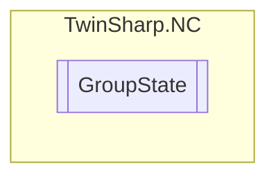

# GroupState `Public class`

## Description
The GroupState class provides properties to interact with and retrieve various states and information
            from a TwinCAT NC group via an AdsClient. It includes properties for error codes, axis counts, group states,
            and emergency stop status, among others. Each property reads or writes data from the TwinCAT system using
            specific index groups and offsets.

## Diagram


## Members
### Properties
#### Public  properties
| Type | Name | Methods |
| --- | --- | --- |
| `uint` | [`CouplingState`](#couplingstate)<br>Coupling state (state) | `get` |
| `uint` | [`CouplingTableIndex`](#couplingtableindex)<br>Coupling table index | `get` |
| `uint` | [`CurrentBlockNumber`](#currentblocknumber)<br>Current block number (only active for interpolation group) | `get` |
| `uint` | [`CurrentFreeSafEntries`](#currentfreesafentries)<br>Current number of free SAF entries/tasks | `get` |
| `uint` | [`CurrentFreeSvbEntries`](#currentfreesvbentries)<br>Current number of free SVB entries/tasks | `get` |
| `uint` | [`CurrentSafEntries`](#currentsafentries)<br>Current number of SAF entries/tasks | `get` |
| `uint` | [`CurrentSvbEntries`](#currentsvbentries)<br>Current number of SVB entries/tasks | `get` |
| `bool` | [`EmergencyStopActive`](#emergencystopactive)<br>Emergency Stop (E-Stop) active? | `get, set` |
| `int` | [`ErrorCode`](#errorcode)<br>Error code group | `get` |
| `uint` | [`MasterAxisCount`](#masteraxiscount)<br>Number of master axes | `get` |
| `uint` | [`MovingState`](#movingstate)<br>Moving state (state) | `get` |
| `uint` | [`ReferencingState`](#referencingstate)<br>Referencing state (state) | `get` |
| `uint` | [`SafGroupState`](#safgroupstate)<br>SAF group state (main state) | `get` |
| `uint` | [`SafSubGroupState`](#safsubgroupstate)<br>SAF sub-group state (sub state) | `get` |
| `uint` | [`SlaveAxisCount`](#slaveaxiscount)<br>Number of slave axes | `get` |
| `uint` | [`SvbGroupState`](#svbgroupstate)<br>SVB group state (state) | `get` |

## Details
### Summary
The GroupState class provides properties to interact with and retrieve various states and information
            from a TwinCAT NC group via an AdsClient. It includes properties for error codes, axis counts, group states,
            and emergency stop status, among others. Each property reads or writes data from the TwinCAT system using
            specific index groups and offsets.

### Constructors
#### GroupState
[*Source code*](https://github.com///blob//TwinSharp/NC/GroupState.cs#L16)
```csharp
internal GroupState(AdsClient client, uint id)
```
##### Arguments
| Type | Name | Description |
| --- | --- | --- |
| `AdsClient` | client |   |
| `uint` | id |   |

### Properties
#### ErrorCode
```csharp
public int ErrorCode { get; }
```
##### Summary
Error code group

#### MasterAxisCount
```csharp
public uint MasterAxisCount { get; }
```
##### Summary
Number of master axes

#### SlaveAxisCount
```csharp
public uint SlaveAxisCount { get; }
```
##### Summary
Number of slave axes

#### SvbGroupState
```csharp
public uint SvbGroupState { get; }
```
##### Summary
SVB group state (state)

#### SafGroupState
```csharp
public uint SafGroupState { get; }
```
##### Summary
SAF group state (main state)

#### MovingState
```csharp
public uint MovingState { get; }
```
##### Summary
Moving state (state)

#### SafSubGroupState
```csharp
public uint SafSubGroupState { get; }
```
##### Summary
SAF sub-group state (sub state)

#### ReferencingState
```csharp
public uint ReferencingState { get; }
```
##### Summary
Referencing state (state)

#### CouplingState
```csharp
public uint CouplingState { get; }
```
##### Summary
Coupling state (state)

#### CouplingTableIndex
```csharp
public uint CouplingTableIndex { get; }
```
##### Summary
Coupling table index

#### CurrentSvbEntries
```csharp
public uint CurrentSvbEntries { get; }
```
##### Summary
Current number of SVB entries/tasks

#### CurrentSafEntries
```csharp
public uint CurrentSafEntries { get; }
```
##### Summary
Current number of SAF entries/tasks

#### CurrentBlockNumber
```csharp
public uint CurrentBlockNumber { get; }
```
##### Summary
Current block number (only active for interpolation group)

#### CurrentFreeSvbEntries
```csharp
public uint CurrentFreeSvbEntries { get; }
```
##### Summary
Current number of free SVB entries/tasks

#### CurrentFreeSafEntries
```csharp
public uint CurrentFreeSafEntries { get; }
```
##### Summary
Current number of free SAF entries/tasks

#### EmergencyStopActive
```csharp
public bool EmergencyStopActive { get; set; }
```
##### Summary
Emergency Stop (E-Stop) active?

*Generated with* [*ModularDoc*](https://github.com/hailstorm75/ModularDoc)
