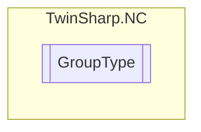

# GroupType `Public enum`

## Diagram

## Details
### Fields
#### NOT_DEFINED

#### PTPGroup

#### Group1D

#### Group2D

#### Group3D

#### HighLowSpeed

#### LowCostStepperMotor

#### TableGroup

#### EncoderGroup

#### FIFOGroup

#### KinematicTransformationGroup

*Generated with* [*ModularDoc*](https://github.com/hailstorm75/ModularDoc)
