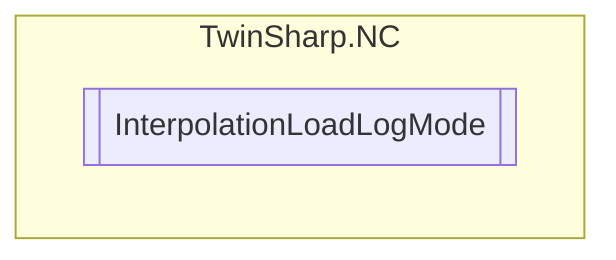

# InterpolationLoadLogMode `Public enum`

## Diagram

## Details
### Fields
#### LoaderLogOff

#### SourceOnly

#### SourceAndCompiled

*Generated with* [*ModularDoc*](https://github.com/hailstorm75/ModularDoc)
