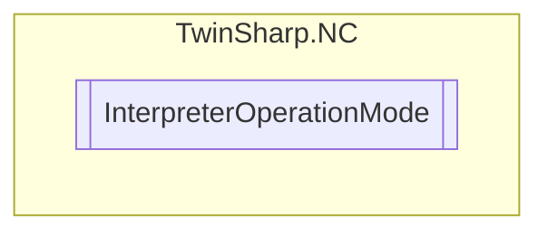

# InterpreterOperationMode `Public enum`

## Diagram

## Details
### Fields
#### Default
##### Summary
Default (deactivates the other modes)

#### SingleBlockNC
##### Summary
Single block mode in the NC core (Block execution task/SAF)

#### SingleBlockInterpreter
##### Summary
Single block mode in the interpreter

*Generated with* [*ModularDoc*](https://github.com/hailstorm75/ModularDoc)
