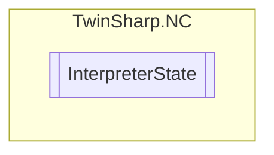

# InterpreterState `Public enum`

## Diagram

## Details
### Fields
#### ITP_STATE_INITFAILED

#### ITP_STATE_IDLE

#### ITP_STATE_READY

#### ITP_STATE_STARTED

#### ITP_STATE_SCANNING

#### ITP_STATE_RUNNING

#### ITP_STATE_STAY_RUNNING

#### ITP_STATE_WRITETABLE

#### ITP_STATE_SEARCHLINE

#### ITP_STATE_END

#### ITP_STATE_SINGLESTOP

#### ITP_STATE_ABORTING

#### ITP_STATE_ABORTED

#### ITP_STATE_FAULT

#### ITP_STATE_RESET

#### ITP_STATE_STOP

#### ITP_STATE_WAITFUNC

#### ITP_STATE_FLUSHBUFFERS

*Generated with* [*ModularDoc*](https://github.com/hailstorm75/ModularDoc)
