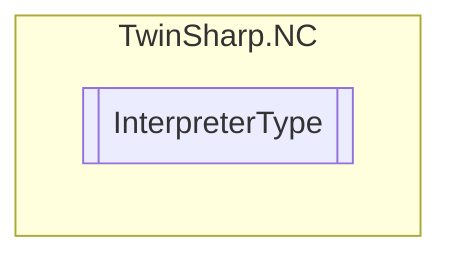

# InterpreterType `Public enum`

## Diagram

## Details
### Fields
#### NotDefined

#### NCInterpreterDIN66025GST

#### NCInterpreterDIN66025ClassicDialect

*Generated with* [*ModularDoc*](https://github.com/hailstorm75/ModularDoc)
