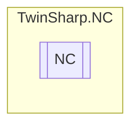

# NC `Public class`

## Description
The NC class provides access to the NC (Numerical Control) system using TwinCAT ADS protocol.
            It initializes and manages the Ring0Manager, Axes, Channels, Groups and Tables components.

## Diagram


## Members
### Properties
#### Public  properties
| Type | Name | Methods |
| --- | --- | --- |
| [`Axis`](./Axis.md)`[]` | [`Axes`](#axes)<br>Gets the array of Axis objects representing the axes in the NC system. | `get, private set` |
| [`Channel`](./Channel.md)`[]` | [`Channels`](#channels)<br>Gets the array of Channel objects representing the channels in the NC system. | `get, private set` |
| [`Group`](./Group.md)`[]` | [`Groups`](#groups)<br>Gets the array of Group objects representing the groups in the NC system. | `get, private set` |
| [`Ring0Manager`](./Ring0Manager.md) | [`Ring0Manager`](#ring0manager)<br>Gets the Ring0Manager instance which manages the low-level operations and state of the NC system. | `get, private set` |
| [`Table`](./Table.md)`[]` | [`Tables`](#tables)<br>Gets the array of Table objects representing the tables in the NC system. | `get, private set` |

## Details
### Summary
The NC class provides access to the NC (Numerical Control) system using TwinCAT ADS protocol.
            It initializes and manages the Ring0Manager, Axes, Channels, Groups and Tables components.

### Constructors
#### NC
[*Source code*](https://github.com///blob//TwinSharp/NC/NC.cs#L19)
```csharp
public NC(AmsNetId target)
```
##### Arguments
| Type | Name | Description |
| --- | --- | --- |
| `AmsNetId` | target | The AmsNetId of the target device to connect to. |

##### Summary
Initializes a new instance of the [NC](twinsharp/nc/NC.md) class.
            This constructor sets up the Ring0Manager and establishes a connection to the TwinCAT ADS client.
            It also initializes the Axes, Channels, Groups, and Tables components using the provided target AmsNetId.

### Properties
#### Ring0Manager
```csharp
public Ring0Manager Ring0Manager { get; private set; }
```
##### Summary
Gets the Ring0Manager instance which manages the low-level operations and state of the NC system.

#### Axes
```csharp
public Axis Axes { get; private set; }
```
##### Summary
Gets the array of Axis objects representing the axes in the NC system.

#### Channels
```csharp
public Channel Channels { get; private set; }
```
##### Summary
Gets the array of Channel objects representing the channels in the NC system.

#### Groups
```csharp
public Group Groups { get; private set; }
```
##### Summary
Gets the array of Group objects representing the groups in the NC system.

#### Tables
```csharp
public Table Tables { get; private set; }
```
##### Summary
Gets the array of Table objects representing the tables in the NC system.

*Generated with* [*ModularDoc*](https://github.com/hailstorm75/ModularDoc)
