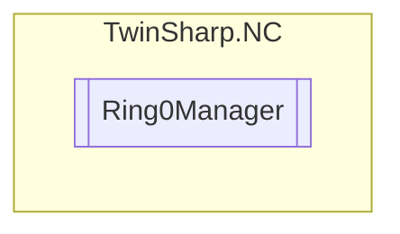

# Ring0Manager `Public class`

## Description
Manages the low level Ring 0 operations for the NC system.

## Diagram


## Members
### Properties
#### Public  properties
| Type | Name | Methods |
| --- | --- | --- |
| [`Ring0Parameters`](./Ring0Parameters.md) | [`Parameters`](#parameters)<br>Gets the parameters for the Ring 0 operations. | `get, private set` |
| [`Ring0State`](./Ring0State.md) | [`State`](#state)<br>Gets the state information for the Ring 0 operations. | `get, private set` |

## Details
### Summary
Manages the low level Ring 0 operations for the NC system.

### Constructors
#### Ring0Manager
[*Source code*](https://github.com///blob//TwinSharp/NC/Ring0Manager.cs#L15)
```csharp
public Ring0Manager(AmsNetId target)
```
##### Arguments
| Type | Name | Description |
| --- | --- | --- |
| `AmsNetId` | target | The target AmsNetId to connect to. |

##### Summary
Initializes a new instance of the [Ring0Manager](twinsharp/nc/Ring0Manager.md) class.
            Connects to the specified target using the ADS client.

### Properties
#### Parameters
```csharp
public Ring0Parameters Parameters { get; private set; }
```
##### Summary
Gets the parameters for the Ring 0 operations.

#### State
```csharp
public Ring0State State { get; private set; }
```
##### Summary
Gets the state information for the Ring 0 operations.

*Generated with* [*ModularDoc*](https://github.com/hailstorm75/ModularDoc)
