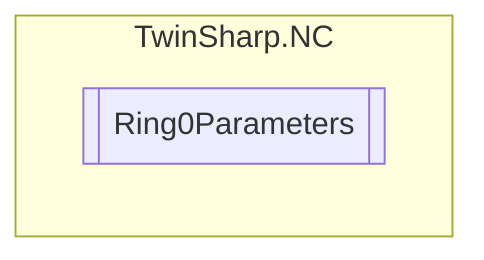

# Ring0Parameters `Public class`

## Description
Represents the parameters for Ring 0, providing access to various settings and configurations
            related to the SAF and SVB tasks, global time compensation, and cyclic data consistency.

## Diagram


## Members
### Properties
#### Public  properties
| Type | Name | Methods |
| --- | --- | --- |
| `uint` | [`CycleTimeSaf`](#cycletimesaf)<br>Cycle time SAF task<br>            Unit: 100 ns | `get` |
| `uint` | [`CycleTimeSvb`](#cycletimesvb)<br>Cycle time SVB task.<br>            Unit: 100 ns | `get` |
| `ushort` | [`CyclicDataConsistenceCheck`](#cyclicdataconsistencecheck)<br>Cyclic data consistence check and correction of the NC setpoint values<br>            Unit: 0/1 | `get, set` |
| `int` | [`GlobalTimeCompensationShift`](#globaltimecompensationshift)<br>Global Time Compensation Shift (for SAF Task).<br>            Unit: ns | `get` |

## Details
### Summary
Represents the parameters for Ring 0, providing access to various settings and configurations
            related to the SAF and SVB tasks, global time compensation, and cyclic data consistency.

### Constructors
#### Ring0Parameters
[*Source code*](https://github.com///blob//TwinSharp/NC/Ring0Parameters.cs#L13)
```csharp
internal Ring0Parameters(AdsClient client)
```
##### Arguments
| Type | Name | Description |
| --- | --- | --- |
| `AdsClient` | client |   |

### Properties
#### CycleTimeSaf
```csharp
public uint CycleTimeSaf { get; }
```
##### Summary
Cycle time SAF task
            Unit: 100 ns

#### CycleTimeSvb
```csharp
public uint CycleTimeSvb { get; }
```
##### Summary
Cycle time SVB task.
            Unit: 100 ns

#### GlobalTimeCompensationShift
```csharp
public int GlobalTimeCompensationShift { get; }
```
##### Summary
Global Time Compensation Shift (for SAF Task).
            Unit: ns

#### CyclicDataConsistenceCheck
```csharp
public ushort CyclicDataConsistenceCheck { get; set; }
```
##### Summary
Cyclic data consistence check and correction of the NC setpoint values
            Unit: 0/1

*Generated with* [*ModularDoc*](https://github.com/hailstorm75/ModularDoc)
