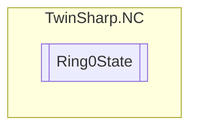

# Ring0State `Public class`

## Description
Represents the state of the Ring 0 system, providing access to various counts and IDs
            for channels, groups, axes, encoders, controllers, drives, and tables.

## Diagram


## Members
### Properties
#### Public  properties
| Type | Name | Methods |
| --- | --- | --- |
| `uint` | [`AxisCount`](#axiscount)<br>Quantity of Axis<br>            0, 1...255 | `get` |
| `uint``[]` | [`AxisIds`](#axisids)<br>Supplies the axis IDs for all axes in the system | `get` |
| `uint` | [`ChannelCount`](#channelcount)<br>Quantity of Channel<br>            0, 1...255 | `get` |
| `uint``[]` | [`ChannelIds`](#channelids)<br>Supplies the Channel IDs for all Channels in the system | `get` |
| `uint` | [`ControllerCount`](#controllercount)<br>Quantity of controller<br>            0, 1...255 | `get` |
| `uint``[]` | [`ControllerIds`](#controllerids)<br>Supplies the controller IDs for all controllers in the system | `get` |
| `uint` | [`DriveCount`](#drivecount)<br>Quantity of Drives<br>            0, 1...255 | `get` |
| `uint``[]` | [`DriveIds`](#driveids)<br>Supplies the drive IDs for all drives in the system | `get` |
| `uint` | [`EncoderCount`](#encodercount)<br>Quantity of Encoder<br>            0, 1...255 | `get` |
| `uint``[]` | [`EncoderIds`](#encoderids)<br>Supplies the encoder IDs for all encoders in the system | `get` |
| `uint` | [`GroupCount`](#groupcount)<br>Quantity of group<br>            0, 1...255 | `get` |
| `uint``[]` | [`GroupIds`](#groupids)<br>Supplies the group IDs for all groups in the system | `get` |
| `uint` | [`TableCount`](#tablecount)<br>Quantity of table (n x m)<br>            0, 1...255 | `get` |
| `uint``[]` | [`TableIds`](#tableids)<br>Supplies the table IDs for all tables in the system | `get` |

## Details
### Summary
Represents the state of the Ring 0 system, providing access to various counts and IDs
            for channels, groups, axes, encoders, controllers, drives, and tables.

### Constructors
#### Ring0State
[*Source code*](https://github.com///blob//TwinSharp/NC/Ring0State.cs#L14)
```csharp
internal Ring0State(AdsClient client)
```
##### Arguments
| Type | Name | Description |
| --- | --- | --- |
| `AdsClient` | client |   |

### Properties
#### ChannelCount
```csharp
public uint ChannelCount { get; }
```
##### Summary
Quantity of Channel
            0, 1...255

#### GroupCount
```csharp
public uint GroupCount { get; }
```
##### Summary
Quantity of group
            0, 1...255

#### AxisCount
```csharp
public uint AxisCount { get; }
```
##### Summary
Quantity of Axis
            0, 1...255

#### EncoderCount
```csharp
public uint EncoderCount { get; }
```
##### Summary
Quantity of Encoder
            0, 1...255

#### ControllerCount
```csharp
public uint ControllerCount { get; }
```
##### Summary
Quantity of controller
            0, 1...255

#### DriveCount
```csharp
public uint DriveCount { get; }
```
##### Summary
Quantity of Drives
            0, 1...255

#### TableCount
```csharp
public uint TableCount { get; }
```
##### Summary
Quantity of table (n x m)
            0, 1...255

#### ChannelIds
```csharp
public uint ChannelIds { get; }
```
##### Summary
Supplies the Channel IDs for all Channels in the system

#### GroupIds
```csharp
public uint GroupIds { get; }
```
##### Summary
Supplies the group IDs for all groups in the system

#### AxisIds
```csharp
public uint AxisIds { get; }
```
##### Summary
Supplies the axis IDs for all axes in the system

#### EncoderIds
```csharp
public uint EncoderIds { get; }
```
##### Summary
Supplies the encoder IDs for all encoders in the system

#### ControllerIds
```csharp
public uint ControllerIds { get; }
```
##### Summary
Supplies the controller IDs for all controllers in the system

#### DriveIds
```csharp
public uint DriveIds { get; }
```
##### Summary
Supplies the drive IDs for all drives in the system

#### TableIds
```csharp
public uint TableIds { get; }
```
##### Summary
Supplies the table IDs for all tables in the system

*Generated with* [*ModularDoc*](https://github.com/hailstorm75/ModularDoc)
