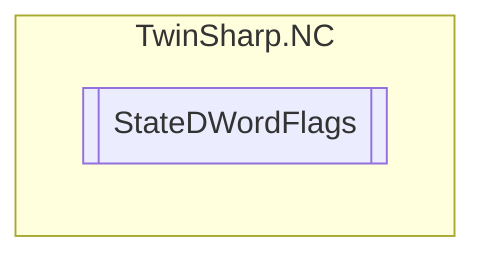

# StateDWordFlags `Public enum`

## Diagram

## Details
### Fields
#### None

#### ReadyForOperation

#### Homed

#### NotMoving

#### InPositionArea

#### InTargetPosition

#### Protected

#### ErrorPropagationDelayed

#### HasBeenStopped

#### HasJob

#### PositiveDirection

#### NegativeDirection

#### HomingBusy

#### ConstantVelocity

#### Compensating

#### ExtSetPointGenEnabled

#### NotImplementedYet

#### ExternalLatchValid

#### NewTargetPosition

#### NotImplementedYet2

#### ContinuousMotion

#### ControlLoopClosed

#### CamTableQueued

#### CamDataQueued

#### CamScalingPending

#### CmdBuffered

#### PTPmode

#### SoftLimitMinExceeded

#### SoftLimitMaxExceeded

#### DriveDeviceError

#### MotionCommandsLocked

#### IoDataInvalid

#### Error

*Generated with* [*ModularDoc*](https://github.com/hailstorm75/ModularDoc)
