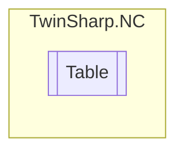

# Table `Public class`

## Description
The `Table` class encapsulates various functionalities, parameters, and states related to a table in the context of TwinCAT ADS.
            It provides a structured way to interact with tables, which are likely used for motion control or other automation tasks.

## Diagram


## Members
### Properties
#### Public  properties
| Type | Name | Methods |
| --- | --- | --- |
| [`TableFunctions`](./TableFunctions.md) | [`Functions`](#functions)<br>Gets the functions related to table operations such as generating and deleting tables. | `get, private set` |
| [`TableParameters`](./TableParameters.md) | [`Parameters`](#parameters)<br>Gets the parameters of the table including ID, name, types, dimensions, and other properties. | `get, private set` |
| [`TableState`](./TableState.md) | [`State`](#state)<br>Gets the state of the table including the user counter. | `get, private set` |

## Details
### Summary
The `Table` class encapsulates various functionalities, parameters, and states related to a table in the context of TwinCAT ADS.
            It provides a structured way to interact with tables, which are likely used for motion control or other automation tasks.

### Constructors
#### Table
[*Source code*](https://github.com///blob//TwinSharp/NC/Table.cs#L12)
```csharp
internal Table(AdsClient client, uint id)
```
##### Arguments
| Type | Name | Description |
| --- | --- | --- |
| `AdsClient` | client |   |
| `uint` | id |   |

### Properties
#### Functions
```csharp
public TableFunctions Functions { get; private set; }
```
##### Summary
Gets the functions related to table operations such as generating and deleting tables.

#### Parameters
```csharp
public TableParameters Parameters { get; private set; }
```
##### Summary
Gets the parameters of the table including ID, name, types, dimensions, and other properties.

#### State
```csharp
public TableState State { get; private set; }
```
##### Summary
Gets the state of the table including the user counter.

*Generated with* [*ModularDoc*](https://github.com/hailstorm75/ModularDoc)
