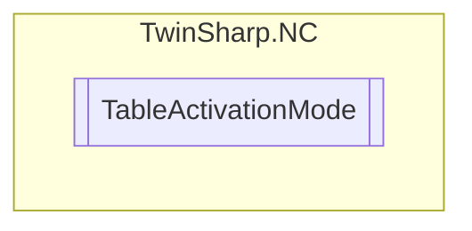

# TableActivationMode `Public enum`

## Diagram

## Details
### Fields
#### Instantaneous

#### MasterCamPosition

#### MasterAxisPosition

#### NextCycle

#### NextCycleOnce

#### AsSoonAsPossible

#### Off

#### DeleteQueuedData

*Generated with* [*ModularDoc*](https://github.com/hailstorm75/ModularDoc)
