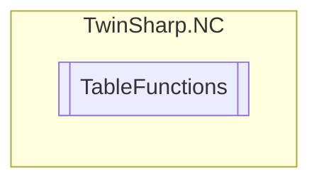

# TableFunctions `Public class`

## Description
The TableFunctions class provides methods to generate and delete various types of tables
            with specified dimensions and interpolation types. It interacts with a TwinCAT AdsClient
            to perform these operations. The class supports generating general tables, valve diagram
            tables, and motion function tables, each with specific table types and dimensions.

## Diagram


## Members
### Methods
#### Public  methods
| Returns | Name |
| --- | --- |
| `void` | [`DeleteTable`](#deletetable)()<br>Deletes table with dimension (n*m)<br>            Table types: 1,2,3,4 |
| `void` | [`GenerateMotionFunctionTable`](#generatemotionfunctiontable)([`TableInterpolationType`](./TableInterpolationType.md) tableType, `uint` lineCount, `uint` columnCount)<br>Generates "Motion Function" table with dimension (n*m):<br>            Table types: 3, 4<br>            Dimension: at least 2x1 |
| `void` | [`GenerateTable`](#generatetable)([`TableInterpolationType`](./TableInterpolationType.md) tableType, `uint` lineCount, `uint` columnCount)<br>Generates table with dimension (n*m):<br>            Table types: 1,2,3,4 <br>            Dimension: at least 2x1 |
| `void` | [`GenerateValveDiagramTable`](#generatevalvediagramtable)([`TableInterpolationType`](./TableInterpolationType.md) tableType, `uint` lineCount, `uint` columnCount)<br>Generates valve diagram table with dimension (n*m):<br>            Table types: 1,3 <br>            Dimension: at least 2x1 |

## Details
### Summary
The TableFunctions class provides methods to generate and delete various types of tables
            with specified dimensions and interpolation types. It interacts with a TwinCAT AdsClient
            to perform these operations. The class supports generating general tables, valve diagram
            tables, and motion function tables, each with specific table types and dimensions.

### Constructors
#### TableFunctions
[*Source code*](https://github.com///blob//TwinSharp/NC/TableFunctions.cs#L16)
```csharp
internal TableFunctions(AdsClient client, uint id)
```
##### Arguments
| Type | Name | Description |
| --- | --- | --- |
| `AdsClient` | client |   |
| `uint` | id |   |

### Methods
#### GenerateTable
[*Source code*](https://github.com///blob//TwinSharp/NC/TableFunctions.cs#L31)
```csharp
public void GenerateTable(TableInterpolationType tableType, uint lineCount, uint columnCount)
```
##### Arguments
| Type | Name | Description |
| --- | --- | --- |
| [`TableInterpolationType`](./TableInterpolationType.md) | tableType |  |
| `uint` | lineCount |  |
| `uint` | columnCount |  |

##### Summary
Generates table with dimension (n*m):
            Table types: 1,2,3,4 
            Dimension: at least 2x1

#### GenerateValveDiagramTable
[*Source code*](https://github.com///blob//TwinSharp/NC/TableFunctions.cs#L51)
```csharp
public void GenerateValveDiagramTable(TableInterpolationType tableType, uint lineCount, uint columnCount)
```
##### Arguments
| Type | Name | Description |
| --- | --- | --- |
| [`TableInterpolationType`](./TableInterpolationType.md) | tableType |  |
| `uint` | lineCount |  |
| `uint` | columnCount |  |

##### Summary
Generates valve diagram table with dimension (n*m):
            Table types: 1,3 
            Dimension: at least 2x1

#### GenerateMotionFunctionTable
[*Source code*](https://github.com///blob//TwinSharp/NC/TableFunctions.cs#L71)
```csharp
public void GenerateMotionFunctionTable(TableInterpolationType tableType, uint lineCount, uint columnCount)
```
##### Arguments
| Type | Name | Description |
| --- | --- | --- |
| [`TableInterpolationType`](./TableInterpolationType.md) | tableType |  |
| `uint` | lineCount |  |
| `uint` | columnCount |  |

##### Summary
Generates "Motion Function" table with dimension (n*m):
            Table types: 3, 4
            Dimension: at least 2x1

#### DeleteTable
[*Source code*](https://github.com///blob//TwinSharp/NC/TableFunctions.cs#L87)
```csharp
public void DeleteTable()
```
##### Summary
Deletes table with dimension (n*m)
            Table types: 1,2,3,4

*Generated with* [*ModularDoc*](https://github.com/hailstorm75/ModularDoc)
