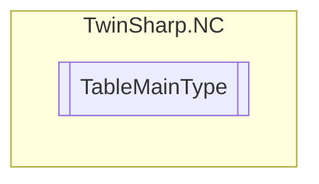

# TableMainType `Public enum`

## Diagram

## Details
### Fields
#### CamPlate

#### CharacteristicCurve

#### MotionFunction

*Generated with* [*ModularDoc*](https://github.com/hailstorm75/ModularDoc)
