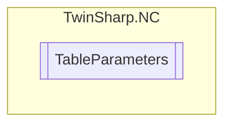

# TableParameters `Public class`

## Description
The TableParameters class provides methods to interact with table parameters in a TwinCAT ADS system.
            It allows reading and writing various table properties such as ID, Name, SubType, MainType, LineCount, ColumnCount, TotalCount, StepWidth, MasterPeriod, and SlaveDifferencePerMasterPeriod.
            It also provides methods to get and set the activation mode for online changes, read and write single values in the table, and convert slave positions to master positions.

## Diagram


## Members
### Properties
#### Public  properties
| Type | Name | Methods |
| --- | --- | --- |
| `uint` | [`ColumnCount`](#columncount)<br>Number of columns (m) | `get` |
| `uint` | [`ID`](#id)<br>Table ID | `get` |
| `uint` | [`LineCount`](#linecount)<br>Number of lines (n) | `get` |
| [`TableMainType`](./TableMainType.md) | [`MainType`](#maintype)<br>Table main type | `get` |
| `double` | [`MasterPeriod`](#masterperiod)<br>Master period (cyclic table).<br>            Base unit (e.g. degree) | `get` |
| `string` | [`Name`](#name)<br>Table name | `get` |
| `double` | [`SlaveDifferencePerMasterPeriod`](#slavedifferencepermasterperiod)<br>Slave difference per master period (cyclic table).<br>            Base unit (e.g. degree) | `get` |
| `double` | [`SlavePositionToMaster`](#slavepositiontomaster)<br>Read slave position to the given master position (relates only to the "row values" of the table) | `get, set` |
| `double` | [`StepWidth`](#stepwidth)<br>Step width (position delta) (equidistant table )<br>            Equidistant Tables<br>            Base unit (e.g. mm) | `get` |
| [`TableSubType`](./TableSubType.md) | [`SubTupe`](#subtupe)<br>Table sub type | `get` |
| `uint` | [`TotalCount`](#totalcount)<br>Total number of elements (n*m) | `get` |

### Methods
#### Public  methods
| Returns | Name |
| --- | --- |
| `void` | [`GetActivationMode`](#getactivationmode)(out [`TableActivationMode`](./TableActivationMode.md) activationMode, out `double` activationPosition, out [`MasterScalingType`](./MasterScalingType.md) masterScalingType, out [`SlaveScalingType`](./SlaveScalingType.md) slaveScalingType) |
| `double` | [`GetSingleValue`](#getsinglevalue)(`uint` line, `uint` column) |
| `void` | [`SetActivationMode`](#setactivationmode)([`TableActivationMode`](./TableActivationMode.md) activationMode, `double` activationPosition, [`MasterScalingType`](./MasterScalingType.md) masterScalingType, [`SlaveScalingType`](./SlaveScalingType.md) slaveScalingType)<br>Set Activation mode for online change from table data (only MF). |
| `void` | [`SetSingleValue`](#setsinglevalue)(`uint` line, `uint` column, `double` value)<br>Write single value [n,m]. |

## Details
### Summary
The TableParameters class provides methods to interact with table parameters in a TwinCAT ADS system.
            It allows reading and writing various table properties such as ID, Name, SubType, MainType, LineCount, ColumnCount, TotalCount, StepWidth, MasterPeriod, and SlaveDifferencePerMasterPeriod.
            It also provides methods to get and set the activation mode for online changes, read and write single values in the table, and convert slave positions to master positions.

### Constructors
#### TableParameters
[*Source code*](https://github.com///blob//TwinSharp/NC/TableParameters.cs#L15)
```csharp
internal TableParameters(AdsClient client, uint id)
```
##### Arguments
| Type | Name | Description |
| --- | --- | --- |
| `AdsClient` | client |   |
| `uint` | id |   |

### Methods
#### GetActivationMode
[*Source code*](https://github.com///blob//TwinSharp/NC/TableParameters.cs#L113)
```csharp
public void GetActivationMode(out TableActivationMode activationMode, out double activationPosition, out MasterScalingType masterScalingType, out SlaveScalingType slaveScalingType)
```
##### Arguments
| Type | Name | Description |
| --- | --- | --- |
| `out` [`TableActivationMode`](./TableActivationMode.md) | activationMode |   |
| `out` `double` | activationPosition |   |
| `out` [`MasterScalingType`](./MasterScalingType.md) | masterScalingType |   |
| `out` [`SlaveScalingType`](./SlaveScalingType.md) | slaveScalingType |   |

#### SetActivationMode
[*Source code*](https://github.com///blob//TwinSharp/NC/TableParameters.cs#L135)
```csharp
public void SetActivationMode(TableActivationMode activationMode, double activationPosition, MasterScalingType masterScalingType, SlaveScalingType slaveScalingType)
```
##### Arguments
| Type | Name | Description |
| --- | --- | --- |
| [`TableActivationMode`](./TableActivationMode.md) | activationMode | Activation mode: 0: 'instantaneous' (default) 1: 'master cam pos.' 2: 'master' axis pos.' 3: 'next cycle' 4: 'next cycle once' 5: 'as soon as possible' 6: 'off' 7: 'delete queued data' |
| `double` | activationPosition | Activation position (e.g. mm) |
| [`MasterScalingType`](./MasterScalingType.md) | masterScalingType | Master scaling type 0: user defined (default) 1: scaling with auto offset 2: off |
| [`SlaveScalingType`](./SlaveScalingType.md) | slaveScalingType | Slave scaling type 0: user defined (default) 1: scaling with auto offset 2: off |

##### Summary
Set Activation mode for online change from table data (only MF).

#### GetSingleValue
[*Source code*](https://github.com///blob//TwinSharp/NC/TableParameters.cs#L154)
```csharp
public double GetSingleValue(uint line, uint column)
```
##### Arguments
| Type | Name | Description |
| --- | --- | --- |
| `uint` | line |  |
| `uint` | column |  |

##### Summary


##### Returns


#### SetSingleValue
[*Source code*](https://github.com///blob//TwinSharp/NC/TableParameters.cs#L182)
```csharp
public void SetSingleValue(uint line, uint column, double value)
```
##### Arguments
| Type | Name | Description |
| --- | --- | --- |
| `uint` | line | n-th line |
| `uint` | column | m-th column |
| `double` | value | Single value. Base unit (e.g. mm) |

##### Summary
Write single value [n,m].

### Properties
#### ID
```csharp
public uint ID { get; }
```
##### Summary
Table ID

#### Name
```csharp
public string Name { get; }
```
##### Summary
Table name

#### SubTupe
```csharp
public TableSubType SubTupe { get; }
```
##### Summary
Table sub type

#### MainType
```csharp
public TableMainType MainType { get; }
```
##### Summary
Table main type

#### LineCount
```csharp
public uint LineCount { get; }
```
##### Summary
Number of lines (n)

#### ColumnCount
```csharp
public uint ColumnCount { get; }
```
##### Summary
Number of columns (m)

#### TotalCount
```csharp
public uint TotalCount { get; }
```
##### Summary
Total number of elements (n*m)

#### StepWidth
```csharp
public double StepWidth { get; }
```
##### Summary
Step width (position delta) (equidistant table )
            Equidistant Tables
            Base unit (e.g. mm)

#### MasterPeriod
```csharp
public double MasterPeriod { get; }
```
##### Summary
Master period (cyclic table).
            Base unit (e.g. degree)

#### SlaveDifferencePerMasterPeriod
```csharp
public double SlaveDifferencePerMasterPeriod { get; }
```
##### Summary
Slave difference per master period (cyclic table).
            Base unit (e.g. degree)

#### SlavePositionToMaster
```csharp
public double SlavePositionToMaster { get; set; }
```
##### Summary
Read slave position to the given master position (relates only to the "row values" of the table)

*Generated with* [*ModularDoc*](https://github.com/hailstorm75/ModularDoc)
