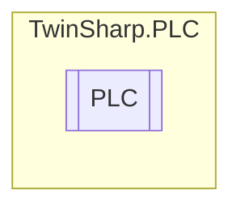

# PLC `Public class`

## Diagram


## Members
### Methods
#### Public  methods
| Returns | Name |
| --- | --- |
| `void` | [`Reset`](#reset)()<br>Can be used to reset a PLC runtime system. When the PLC is reset, the PLC variables are filled with their initial values, and the execution of the PLC program is stopped.<br>            Equivavalent to the function block PLC_Reset. |
| `void` | [`Start`](#start)()<br>Can be used to start a PLC runtime system on a TwinCAT system. The function block can, for instance, be used to start the PLC on a remote PC.<br>            Equivavalent to the function block PLC_Start. |
| `void` | [`Stop`](#stop)()<br>Can be used to stop a PLC runtime system on a TwinCAT system. The function block can, for instance, be used to stop the PLC on a remote or a local PC.<br>            Equivavalent to the function block PLC_Stop. |

## Details
### Constructors
#### PLC
[*Source code*](https://github.com///blob//TwinSharp/PLC/Plc.cs#L10)
```csharp
public PLC(AdsClient client)
```
##### Arguments
| Type | Name | Description |
| --- | --- | --- |
| `AdsClient` | client |   |

### Methods
#### Start
[*Source code*](https://github.com///blob//TwinSharp/PLC/Plc.cs#L21)
```csharp
public void Start()
```
##### Summary
Can be used to start a PLC runtime system on a TwinCAT system. The function block can, for instance, be used to start the PLC on a remote PC.
            Equivavalent to the function block PLC_Start.

#### Stop
[*Source code*](https://github.com///blob//TwinSharp/PLC/Plc.cs#L36)
```csharp
public void Stop()
```
##### Summary
Can be used to stop a PLC runtime system on a TwinCAT system. The function block can, for instance, be used to stop the PLC on a remote or a local PC.
            Equivavalent to the function block PLC_Stop.

#### Reset
[*Source code*](https://github.com///blob//TwinSharp/PLC/Plc.cs#L51)
```csharp
public void Reset()
```
##### Summary
Can be used to reset a PLC runtime system. When the PLC is reset, the PLC variables are filled with their initial values, and the execution of the PLC program is stopped.
            Equivavalent to the function block PLC_Reset.

*Generated with* [*ModularDoc*](https://github.com/hailstorm75/ModularDoc)
