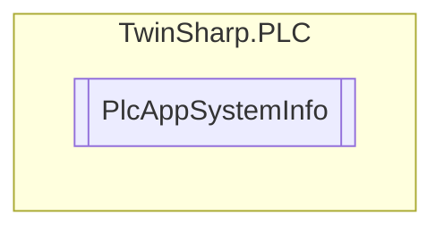

# PlcAppSystemInfo `Public class`

## Diagram


## Members
### Properties
#### Public  properties
| Type | Name | Methods |
| --- | --- | --- |
| `uint` | [`AdsPort`](#adsport)<br>ADS port of the PLC application. | `get` |
| `string` | [`AppName`](#appname)<br>Name generated by TwinCAT, which contains the port. | `get` |
| `DateTime` | [`AppTimestamp`](#apptimestamp)<br>Time at which the PLC application was compiled | `get` |
| `bool` | [`BSODOccured`](#bsodoccured)<br>This variable has the value TRUE if Windows is in a BSOD. | `get` |
| `bool` | [`BootDataLoaded`](#bootdataloaded)<br>PERSISTENT variables: LOADED (without error). | `get` |
| `uint` | [`Flags`](#flags)<br>TwinCAT internal use. | `get` |
| `bool` | [`KeepOutputsOnBP`](#keepoutputsonbp)<br>The flag can be set and prevents that the outputs are zeroed when a breakpoint is reached. In this case the task continues to run. Only the execution of the PLC code is interrupted. | `get, set` |
| `bool` | [`LicensesPending`](#licensespending)<br>This variable has the value TRUE if not all licenses that are provided by license dongles have been validated yet. | `get` |
| `ulong` | [`ObjId`](#objid)<br>Object ID of the PLC project instance. | `get` |
| `bool` | [`OldBootData`](#oldbootdata)<br>PERSISTENT variables: INVALID (the back-up copy was loaded, since no valid file was present). | `get` |
| `ulong` | [`OnlineChangeCnt`](#onlinechangecnt)<br>Number of online changes since the last complete download | `get` |
| `string` | [`ProjectName`](#projectname)<br>Name of the project. | `get` |
| `bool` | [`ShutdownInProgress`](#shutdowninprogress)<br>This variable has the value TRUE if a shutdown of the TwinCAT system is in progress. Some parts of the TwinCAT system may already have been shut down. | `get` |
| `ulong` | [`TaskCnt`](#taskcnt)<br>Number of tasks in the runtime system | `get` |

## Details
### Constructors
#### PlcAppSystemInfo
[*Source code*](https://github.com///blob//TwinSharp/PLC/PlcAppSystemInfo.cs#L11)
```csharp
internal PlcAppSystemInfo(AdsClient client)
```
##### Arguments
| Type | Name | Description |
| --- | --- | --- |
| `AdsClient` | client |   |

### Properties
#### ObjId
```csharp
public ulong ObjId { get; }
```
##### Summary
Object ID of the PLC project instance.

#### Flags
```csharp
public uint Flags { get; }
```
##### Summary
TwinCAT internal use.

#### AdsPort
```csharp
public uint AdsPort { get; }
```
##### Summary
ADS port of the PLC application.

#### BootDataLoaded
```csharp
public bool BootDataLoaded { get; }
```
##### Summary
PERSISTENT variables: LOADED (without error).

#### OldBootData
```csharp
public bool OldBootData { get; }
```
##### Summary
PERSISTENT variables: INVALID (the back-up copy was loaded, since no valid file was present).

#### AppTimestamp
```csharp
public DateTime AppTimestamp { get; }
```
##### Summary
Time at which the PLC application was compiled

#### KeepOutputsOnBP
```csharp
public bool KeepOutputsOnBP { get; set; }
```
##### Summary
The flag can be set and prevents that the outputs are zeroed when a breakpoint is reached. In this case the task continues to run. Only the execution of the PLC code is interrupted.

#### ShutdownInProgress
```csharp
public bool ShutdownInProgress { get; }
```
##### Summary
This variable has the value TRUE if a shutdown of the TwinCAT system is in progress. Some parts of the TwinCAT system may already have been shut down.

#### LicensesPending
```csharp
public bool LicensesPending { get; }
```
##### Summary
This variable has the value TRUE if not all licenses that are provided by license dongles have been validated yet.

#### BSODOccured
```csharp
public bool BSODOccured { get; }
```
##### Summary
This variable has the value TRUE if Windows is in a BSOD.

#### TaskCnt
```csharp
public ulong TaskCnt { get; }
```
##### Summary
Number of tasks in the runtime system

#### OnlineChangeCnt
```csharp
public ulong OnlineChangeCnt { get; }
```
##### Summary
Number of online changes since the last complete download

#### AppName
```csharp
public string AppName { get; }
```
##### Summary
Name generated by TwinCAT, which contains the port.

#### ProjectName
```csharp
public string ProjectName { get; }
```
##### Summary
Name of the project.

*Generated with* [*ModularDoc*](https://github.com/hailstorm75/ModularDoc)
