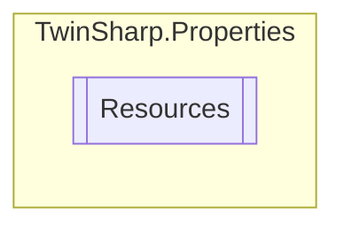

# Resources `Internal class`

## Description
A strongly-typed resource class, for looking up localized strings, etc.

## Diagram


## Members
### Properties
#### Internal Static properties
| Type | Name | Methods |
| --- | --- | --- |
| `CultureInfo` | [`Culture`](#culture)<br>Overrides the current thread's CurrentUICulture property for all<br>              resource lookups using this strongly typed resource class. | `get, set` |
| `ResourceManager` | [`ResourceManager`](#resourcemanager)<br>Returns the cached ResourceManager instance used by this class. | `get` |

## Details
### Summary
A strongly-typed resource class, for looking up localized strings, etc.

### Constructors
#### Resources
[*Source code*](https://github.com///blob//TwinSharp/Properties/Resources.Designer.cs#L31)
```csharp
internal Resources()
```

### Properties
#### ResourceManager
```csharp
internal static ResourceManager ResourceManager { get; }
```
##### Summary
Returns the cached ResourceManager instance used by this class.

#### Culture
```csharp
internal static CultureInfo Culture { get; set; }
```
##### Summary
Overrides the current thread's CurrentUICulture property for all
              resource lookups using this strongly typed resource class.

*Generated with* [*ModularDoc*](https://github.com/hailstorm75/ModularDoc)
